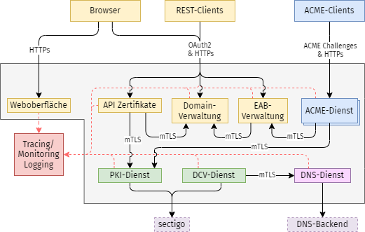

# PKI-Portal Backend

This project contains all backend services required for running a self-service PKI-Protal providing a middleware between GEANT-TCS sectigo and the endusers. It is a mixture out of enduser facing REST-APIs and some internal GRPC service communicating with sectigo and other services like the DNS backend.



## Prerequirements

At the moment the setup is a little complex and requires some manual steps and interaction. Feel free to provide some optimizations and improvments. In the best case you run the complete setup in an existing k8s cluster and adapt the deployment located [here](https://github.com/hm-edu/infrastructure/tree/main/clusters/production/portal). Otherwise, you can run the setup using a local docker engine or even running single exectuables on bare metal.

### Docker Deployment

The docker deployment is the easiest way to get started. It requires a running docker engine and docker-compose. The docker-compose file is located inside this repository. 

Before getting started you must configure at least your own sectigo credentials and set the organization ID for ssl and smime certificates.

```bash
cp .env.example .env
vim .env
```

Afterwards you can start the whole setup using the following command:

```bash
docker-compose up -d
```

For a more sophisticated setup you can of cource configure the docker-compose file to your needs and define other values and parameters.


## Manual Actions

The most use cases can be fulfilled be the webfrontend, but there are some edge-cases that require manual interaction with the Database it self.

### Permitting wildcard certificates or IPv4 addresses

By default users are not allowed to create wildcard hosts or IPv4 entries. Some rare applications like the ezProxy or k8s require the creation of wildcard certificates. Also, implementing DoT, DoH and ADD-DDR requires certificates containing a IPv4 address. At the time of writing this can be realized by adding the according records directly to the database.

Therefor, you must have a psql shell for the database `domain` and must execute the following statement. Please replace the fqdn and the owner accordingly to your setup.

```
domain=# insert into domains(create_time, update_time, fqdn, owner, approved) values (now(),now(), '*.kube.cs.hm.edu', 'florian.ritterhoff@hm.edu', True);
```

Please keep in mind, that creating wildcard certificates using ACME requires solving DNS challenges!